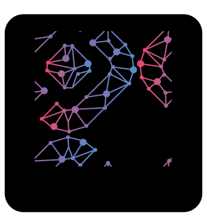

# Neubla React Components
<p allign="center">

</p>

[](https://github.com/sonr-io/nebula-react/actions/workflows/Build-and-Test.yml)

[](https://codecov.io/gh/sonr-io/nebula-react)

## What is Nebula?
Nebula is the Sonr design system, used in all application and UI components acrros the Sonr ecosystem. See [here](https://www.figma.com/file/mTow2ms25MRnGXAvh04gc5/Nebula-v0.01?node-id=0%3A1) to learn more about the Nebula Design System.

## what is Nebula React
Nebula React is the Nebula design system implemented in the React framework. All components within this repository are implemented with the nebula design system standards.

# Components
```
LoginButton
RegisterButton
RegisterForm
```

# Installation

```
npm i @sonr-io/nebula-react
```

## Building From Source

```
    npm run coverage - runs defined unit tests and reports code coverage
    npm run test - runs defined unit tests
    npm run build - Builds components for production
    npm run storybook - Builds and launches storybook dev server
    npm run build-story - Builds storybook assets
```
